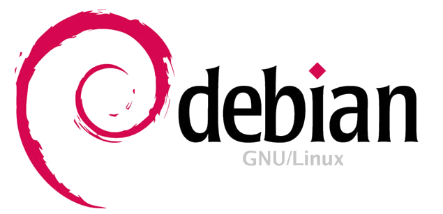

Debian installation
===================

.. contents:: Topics

.. highlight:: bash

Dedicated MySecureShell repository
----------------------------------

If you want to use the latest version of MySecureShell, the simplest way is to use the official dedicated repository.

Debian 8 (Jessie)
^^^^^^^^^^^^^^^^^

MySecureShell is available by default in Debian Jessie. To install it::

    > apt-get update
    > apt-get install mysecureshell

To enable all features, you'll have to set a setuid on the ``mysecureshell`` binary::

    > chmod 4755 /usr/bin/mysecureshell

Debian 7 (Wheezy)
^^^^^^^^^^^^^^^^^

First, add the repository lines in */etc/apt/sources.list.d/mysecureshell.list*::

    > echo "deb http://mysecureshell.free.fr/repository/index.php/debian/7.1 testing main
    deb-src http://mysecureshell.free.fr/repository/index.php/debian/7.1 testing main" > /etc/apt/sources.list.d/mysecureshell.list

Then import the GPG repository key::

    > gpg --keyserver hkp://pool.sks-keyservers.net --recv-keys E328F22B
    > gpg --export E328F22B | apt-key add -

You're now ready to install MySecureShell::

    > apt-get update
    > apt-get install mysecureshell

Debian 6 (Squeeze)
^^^^^^^^^^^^^^^^^^

First, add the repository lines in */etc/apt/sources.list.d/mysecureshell.list*::

    > echo "deb http://mysecureshell.free.fr/repository/index.php/debian/6.0 testing main
    deb-src http://mysecureshell.free.fr/repository/index.php/debian/6.0 testing main" > /etc/apt/sources.list.d/mysecureshell.list

Then import the GPG repository key::

    > gpg --keyserver hkp://pool.sks-keyservers.net --recv-keys E328F22B
    > gpg --export E328F22B | apt-key add -

You're now ready to install MySecureShell::

    > apt-get update
    > apt-get install mysecureshell

