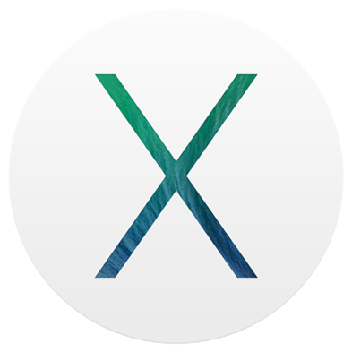

Mac OS X installation
=====================

.. contents:: Topics

.. highlight:: bash

Dedicated MySecureShell repository
----------------------------------

If you want to use the latest version of MySecureShell, the simplest way is to use `brew tool <http://brew.sh/>`_.

First, install brew::

    # ruby -e "$(curl -fsSL https://raw.github.com/Homebrew/homebrew/go/install)"

You're now ready to install MySecureShell::

    # brew install mysecureshell
