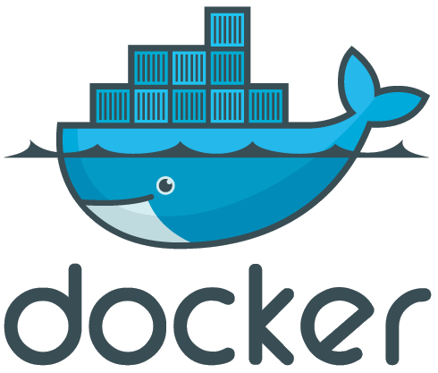

Docker
======

.. contents:: Topics

.. highlight:: bash

Docker is an open platform for developers and sysadmins to build, ship, and run distributed applications. It only works on Linux.

Install prequesites
-------------------

How does it works? First of all, you need install Docker on your Linux host:

* `Docker <www.docker.com>`_: easily create containers

Run Dockerfile
--------------

Once done, on your machine install the MySecureShell Dockerfile::

    $ docker build -t mysecureshell \
    https://raw.githubusercontent.com/mysecureshell/mysecureshell/master/deployment-tools/docker/Dockerfile

Here is the content of the Dockerfile:

.. literalinclude:: ../../Dockerfile
   :language: bash

Boot the container
------------------

You can now launch the Docker container::

    $ docker run -d -p 22222:22 mysecureshell

Connect and test
----------------

MySecureShell is now ready to serve! From your host machine, you can connect with user *mssuser* and *mssuser* for the password::

    $ sftp -P 22222 mssuser@127.0.0.1
    mssuser@127.0.0.1's password: 
    Connected to 127.0.0.1.
    sftp> ls
    sftp> pwd
    Remote working directory: /

In parallel, connect from your host machine to the Virtual Machine (root password is *root*)::

    $ ssh -p 22222 root@127.0.0.1

and see the current connected user with `sftp-who` command::

    $ sftp-who
    --- 1 / 10 clients ---
    Global used bandwith : 0 bytes/s / 0 bytes/s
    PID: 3389   Name: mssuser   IP: 
        Home: /home/mssuser
        Status: idle    Path: /
        File: 
        Connected: 2014/08/19 15:38:27 [since 10s]
        Speed: Download: 0 bytes/s [5.00 kbytes/s]  Upload: 0 bytes/s [unlimited]
        Total: Download: 1398 bytes   Upload: 141 bytes

You can see the connected user :-). You can try to upload files to see the result. Of course you can use graphical clients. And if you want to play with the server configuration, look at ``/etc/ssh/sftp_config``.
